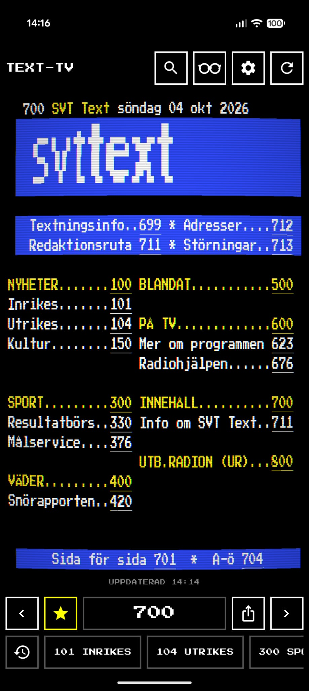
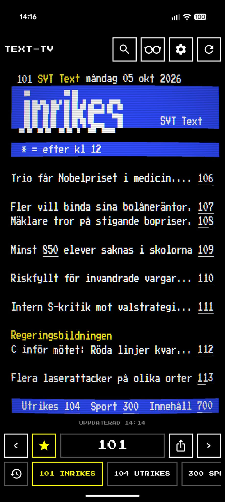
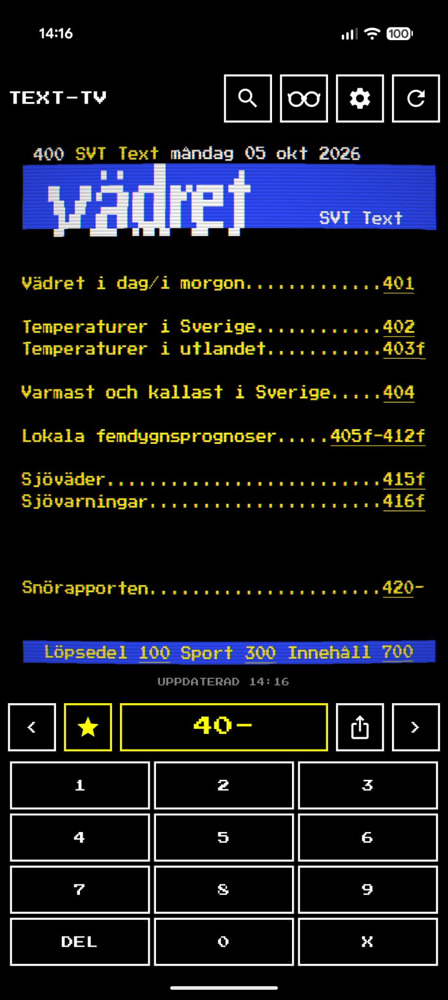
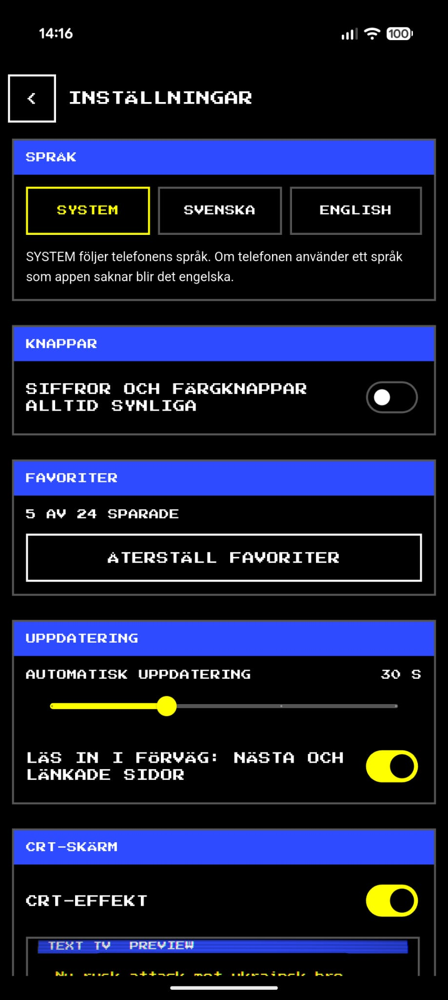
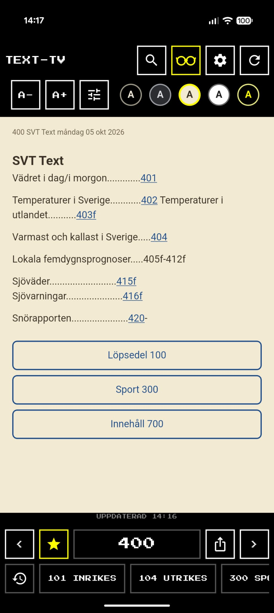

# Text TV

An Android viewer (in Swedish and English) for **SVT Text**, Swedish teletext (pages 100–899), in its own colours and block graphics. It reads the public [texttv.nu](https://texttv.nu) API.

Personal project, built with Flutter.

## Screenshots and video

<details>
<summary><b>Show screenshots</b> (5)</summary>

<p>
  
  
  
  
  
</p>

1. The contents page (700), with the optional CRT look; the chips under the page are the favourites, the clock chip lists recent pages.
2. Domestic news (101).
3. The number pad, with a page number half typed.
4. Settings, here in Swedish.
5. Reader mode, on the beige scheme.

</details>

<details>
<summary><b>Show video</b> (about 5 MB)</summary>

[Watch the app in use](images/video/app_show_case_video.mp4): GitHub plays it in the browser.

</details>

## Features

- Every page, 100–899, drawn as the 40-column teletext grid: the eight teletext colours, double-height headlines, the block-graphics logo, underlined page links.
- Tap a page number in the page to open it. Swipe left/right to move between the parts of a page and then between pages.
- `<` / `>` arrows (following the site's own neighbouring pages), a number pad (tap the page number to open it), and favourites as chips under the page (to start with 100 NYHETER, 101 INRIKES, 104 UTRIKES, 300 SPORT, 400 VÄDER and 700 INNEHÅLL; star a page to add it, star it again to remove it, reset them in settings). The clock chip at the start of the row lists the pages you read last. Long-pressing the app icon lists your first four favourites.
- Reader mode (the glasses button): the page as text reflowed to the screen, with `A-`/`A+` for the text size, five colour schemes (black, grey, beige, paper, high contrast), and options for line spacing, letter spacing, margins and bold. Headlines, links and tables are kept.
- Portrait only.
- A settings page (the gear button) with an optional CRT look for the teletext page: a slight screen bulge, scanlines and a vignette, each adjustable within safe limits and remembered. Taps still land on what you see.
- Back steps through the pages you have read, then leaves the app.
- Opens where you left off: the page, its part and the pages you came through.
- Optional (settings > CONTROLS): an always-visible number pad (the box shows `1--` as you type) and coloured Fastext keys built from a page's bottom row of links. Off by default, which leaves the page the most height.
- Paging feels instant: after a page arrives, the app quietly reads a few pages ahead (the next and previous page and the ones it links to), one at a time, and a new page slides in from the side you turned to. Reading ahead can be switched off in settings.
- Pull the page down to read it again. It also refreshes itself when you come back to the app after a couple of minutes, and, if you turn it on in settings, every 30 seconds, minute or two minutes while you read. A dim line shows when it was last updated.
- Pages read in the last five minutes are reused; the refresh button asks the site again. Failures say why and offer TRY AGAIN.
- Works offline for pages you have read: they are saved on the phone, shown at once, refreshed behind, and marked "OFFLINE. SAVED 14:32" when the site cannot be reached.
- Bundled pixel font; the only permission is `INTERNET`.

## Build and run

Needs Flutter 3.47 or newer (Dart ^3.13) and the Android SDK.

```
flutter pub get
flutter run                 # on a connected device or emulator
flutter build apk --debug   # build/app/outputs/flutter-apk/app-debug.apk
```

### Checks

```
dart format --output=none --set-exit-if-changed .
flutter analyze
flutter test
```

CI runs the same (`.github/workflows/ci.yml`). Tests never touch the network: they use fakes and real answers saved in `test/fixtures/`.

### Release build

`flutter build apk --release` signs with the debug key unless `android/key.properties` exists (git-ignored; see [.agents/android.md](.agents/android.md)).

## How it works

```
TextTvScreen (ui) ──▶ TextTvRepository ──▶ TextTv (texttv.nu client) ──▶ HttpFetcher
        │                                         │
        └──────────────▶ model: TextTvPage, styled rows, layout maths ◀─┘
```

Architecture notes, the behaviour spec and the decisions log are in [.agents/architecture.md](.agents/architecture.md). Contributor and agent guidelines start at [AGENTS.md](AGENTS.md).

## Credits and licence

- Content: SVT Text, relayed by [texttv.nu](https://texttv.nu). The app sends its own `app` id (`texttv_android`) with every request, as the site's API asks.
- Fonts, all SIL Open Font License 1.1 (the licences are in `fonts/`): [Press Start 2P](https://fonts.google.com/specimen/Press+Start+2P) by CodeMan38 for the teletext page; [Atkinson Hyperlegible](https://brailleinstitute.org/freefont) by the Braille Institute and [OpenDyslexic](https://opendyslexic.org) by Abbie Gonzalez as the reader mode's choice of typeface; [Bedstead](https://bjh21.me.uk/bedstead/) by Ben Harris (public domain, CC0, `fonts/CC0-Bedstead.txt`) is the other typeface for the teletext page.
- Code: [MIT](LICENSE) © 2026 Kay Wiberg. The bundled font keeps its own licence.
